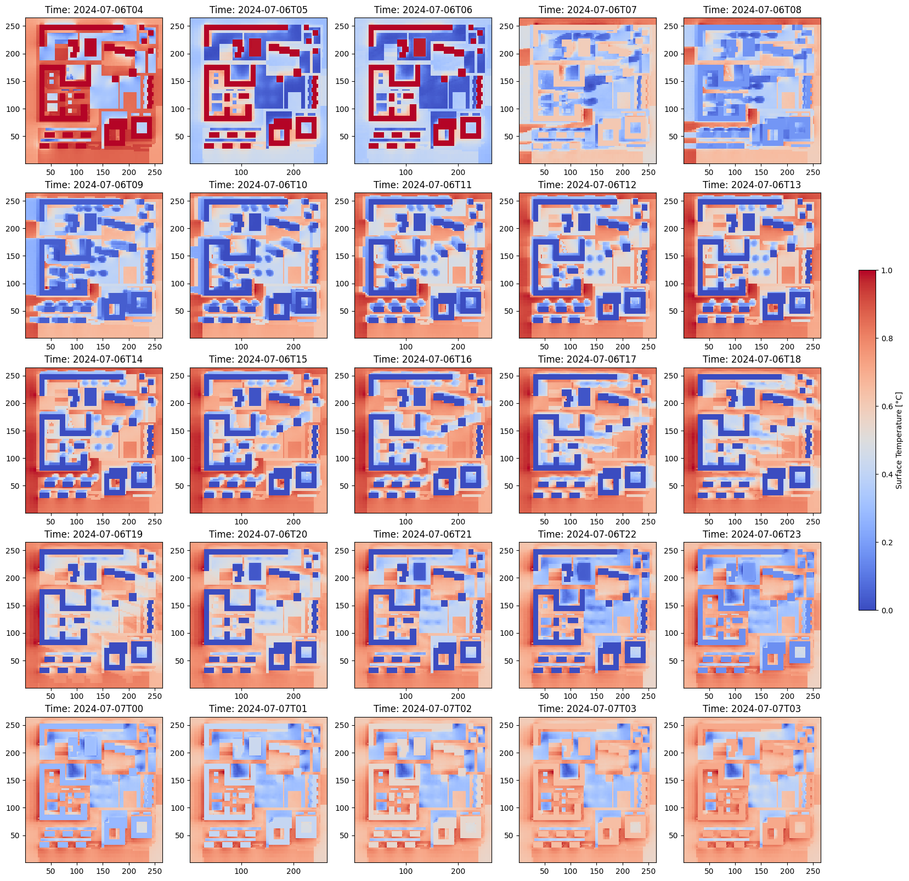

# microclimate-simulation



## Goal

Visualization of ENVI-met microclimate simulation data on a dashboard.

This project is based on two simulation outputs from the ENVI-met microclimate model, each representing different scenarios. The first scenario illustrates the current or "status quo" conditions, while the second ("optimized") scenario includes various mitigation measures aimed at enhancing thermal comfort in the area.

The primary goal is to develop Python scripts that generate clear, insightful visualizations of these outputs. These visualizations enable users to easily interpret results, compare scenarios, and gain a comprehensive understanding of how the mitigation measures impact thermal comfort.

### **Input Data Overview:**

- Input data for both simulation runs:
  - Model area (INX file)
  - Simulation configuration (SIMX file)
  - Project information (INFOX and EDB files)
  - Climate input data (FOX file)
- Output data for both simulation runs:
  - netCDF file format

## Demo

[Microclimate Simulation Dashboard](https://microclimate-simulation.onrender.com/)


## Details

- [More info about the example](https://envi-met.info/doku.php?id=examples:playground)
- [KPIs description](https://envi-met.info/doku.php?id=filereference:output:atmosphere)
- [ENVI-met Model Architecture](https://envi-met.info/doku.php?id=intro:modelconept)
- [File extensions](data/file_extensions.md)


## Setup

### Running Locally

1. Activate the virtual environment:

   ```
   .\venv\Scripts\activate
   ```

2. Install the dependencies:

   ```
   pip install -r requirements.txt
   ```

3. Navigate to the `/src` folder:

   ```
   cd src
   ```

4. Run the `app.py` file:

   ```
   python app.py
   ```

---

### Repository Structure

To display the repository structure in the terminal:

```powershell
Get-ChildItem -Recurse -File | Where-Object { $_.FullName -notmatch "venv|__pycache__" } | Format-Table -Property FullName
```
