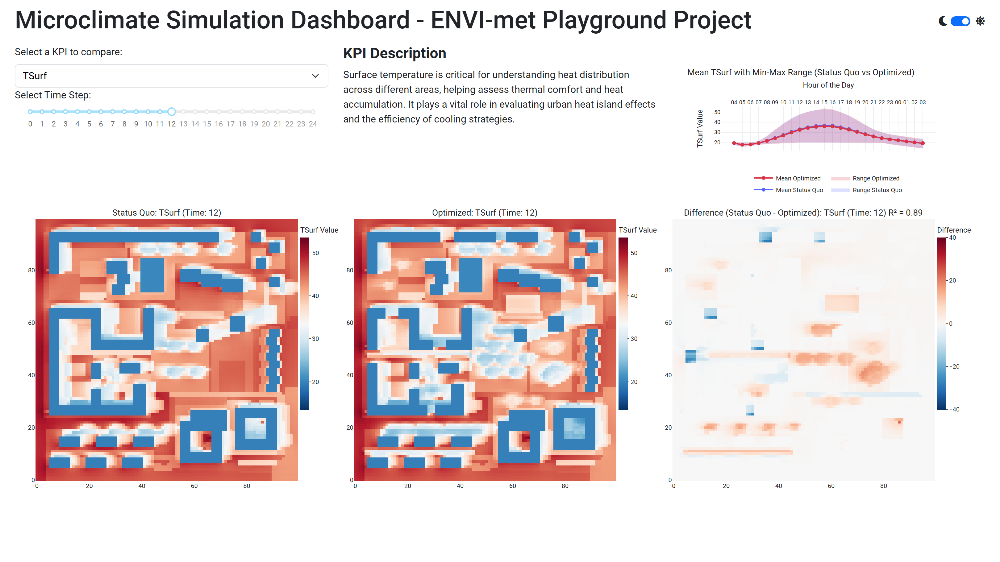

# microclimate-simulation


## Goal

The goal of this project is to develop Python scripts that generate clear, insightful visualizations
of these data outputs. These visualizations should enable users to easily interpret
the results, compare the two scenarios, and gain a comprehensive understanding
of how the mitigation measures affect thermal comfort.

The final output should present the visualizations in a report-style format,
ensuring that the graphics effectively communicate the differences between the
scenarios including some short information about what and why it is shown.

**The provided data contains:**

- The input data of both simulation runs
  - model area (INX-File)
  - simulation config (SIMX-File)
  - project information (INFOX-File and EDB-File)
  - climate input data (FOX-File)
- The output data of both simulation runs
  - netCDF file format

## Demo

[Microclimate Simulation Dashboard](https://microclimate-simulation.onrender.com/)


## Details

- [More info about the example](https://envi-met.info/doku.php?id=examples:playground)
- [KPIs description](https://envi-met.info/doku.php?id=filereference:output:atmosphere)
- [ENVI-met Model Architecture](https://envi-met.info/doku.php?id=intro:modelconept)
- [File extensions](data/file_extensions.md)


## Set up

### Running locally

1. Activate the venv

```
.\venv\Scripts\activate
```

2. Intall the dependencies

```
pip install -r requirements.txt
```

3. Naviagate to /src folder

```
cd src
```

4. Naviagate to /src folder

```
python app.py
```
